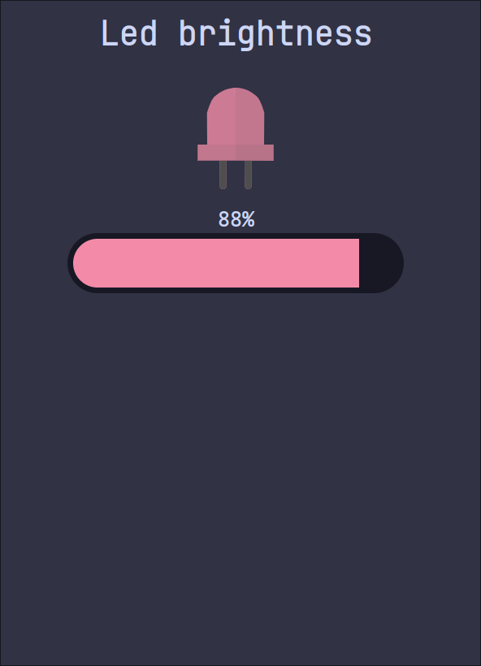

# Led Brightness PWM

## Description

This project demonstrates how to use an ESP32C3 to control the brightness of an LED remotely via a Wi-Fi network. The brightness of the LED is controlled via *Pulse Width Modulation* (**PWM**).

This project incorporates a web application built with Vue.js to facilitate LED brightness adjustment.



## Overview

### LED Control

The led controller can be found under `led-brightness/`. 

First of all you need to set `wifi_ssid` and `wifi_pwd`, to do so create a copy of `cfg.toml.example` and rename it to `cfg.toml`, then set your Wi-Fi data.

```toml
# cfg.toml.example
[led-brightness]
wifi_ssid = "FBI Surveillance Van"
wifi_pwd = "hunter2"
```

The web server exposes the following endpoints:

- `GET`: `/brightness`
  returns:

  ```json
  {
      "max": "<max duty>",
      "current": "<current duty>"
  }
  ```

- `PUT`: `/brightness?<val>` where: $0 \leq$ `val` $\leq 100$
  used to set LED brightness
- `OPTIONS`: `/brightness`
  used for CORS

The **PWM** is set to **Gpio6**.

### Web app

The web app can be found under `slider/`.

To run it you need to:

- Install dependences:

  ```bash
  $ yarn install
  ```

- Set `BOARD_IP` in `./src/components/Slider.vue` with the IP shown in the logs;

- Start the app:

  ```bash
  $ yarn dev
  ```

  or

  ```bash
  $ yarn dev --host
  ```

  to use it remotely (must be under same Wi-Fi network).
